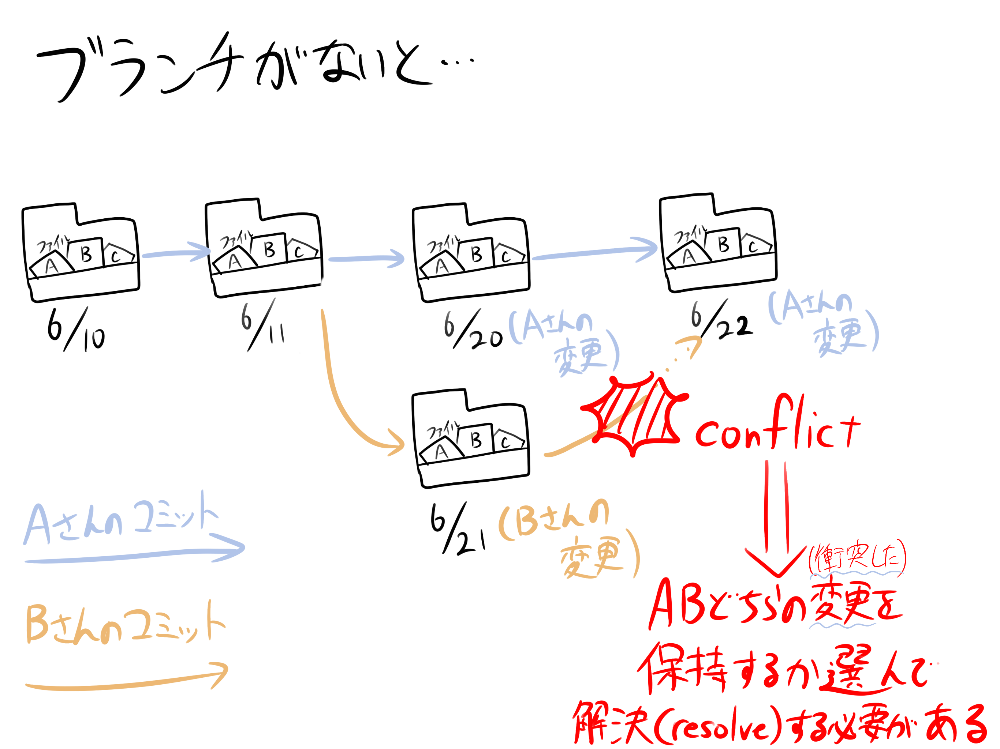
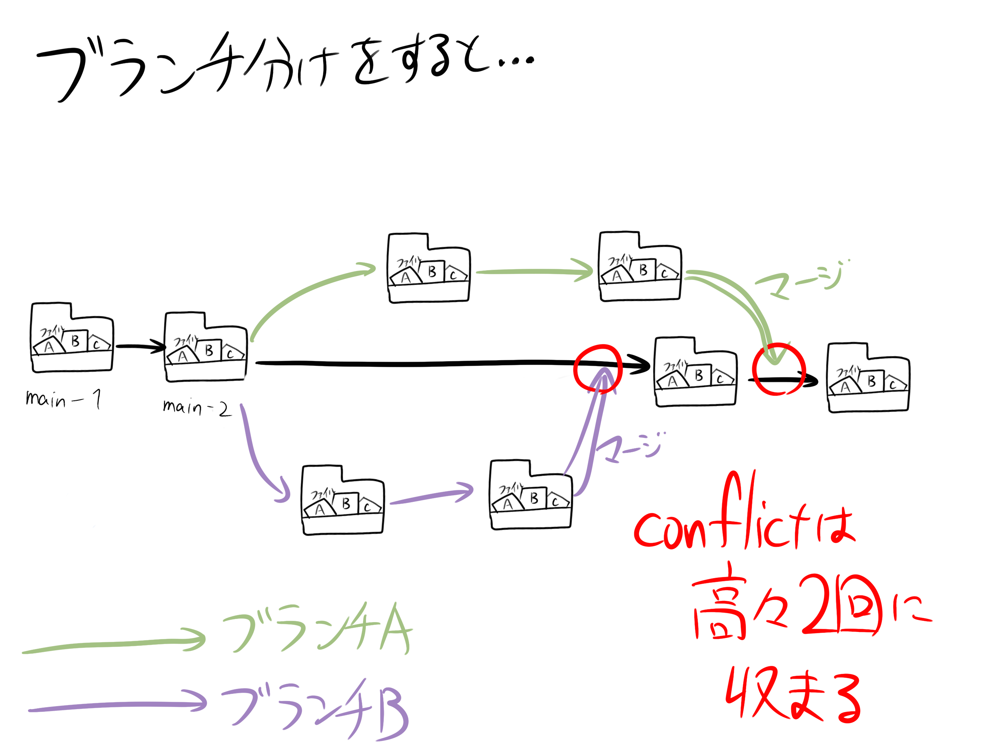

<!--
class: slides
-->
# Week 2

# 開発環境とチーム開発の入口

---

# 目次
- ファイル管理（Git）の導入
- Webアプリの構成（ざっくり）

---

# ファイル管理 (Git)

---
# Gitの導入
---
## 研究会で取り組めるデジタル創作
- イラスト
- 音楽制作
- 3Dモデリング
- Web開発
- ゲーム開発
- 動画編集etc...

---

## すべてUndo（やりなおし：Ctrl + Z）が効いて助かる
- 作ってる途中でもとに戻せたらうれしいよね

---

## Undoの欠点
- ファイルを開いてる時の変更だけしか戻せない
- 変更を戻してから少しでも変更を加えると、二度とやり直しが聞かない
    - 1本のつながった変更履歴しか覚えていてくれない

---

## 手動バージョン管理
- プロジェクトを管理しているディレクトリを複製してバージョン名をつける
- ただ、複製するたびに容量が膨れ上がるし面倒...
    - ディレクトリ＝フォルダ
- ディレクトリ例：プロジェクト (2026-06-10)、プロジェクト（2026-06-11）、プロジェクト（2026-06-12）

---

## 手動バージョン管理 cont'd

---

## Gitとは

- バージョン管理の補助ソフト
    - 単体のファイルではなく、ディレクトリ内のすべてのファイルを管理
        - ◯どんなファイルにも対応
        - ◎テキストファイルとの相性抜群

---

## Gitにおける用語の確認
- コミット (commit)・・・ディレクトリ全体をセーブする
- ブランチ (branch)・・・作業部屋のようなもの
- リポジトリ (repository)・・・管理対象のディレクトリ

---

## Gitにおける用語の確認

---

## ブランチを分けないとどうなるの？
- AさんBさんが同じファイルを編集していたとする
- Aさんが変更をコミットした後にBさんが別の変更をコミットすると...
- 大抵は自動で変更をマージ（Merge: 結合）してくれるが...
- 編集場所が被っていると片方の内容が消えてしまう！
    - これをコンフリクト（conflict: 衝突）と言う
    - コンフリクトしたコミットの変更をすべて確認し、それぞれどちらの変更を保持するか選ぶ必要がある（解決：resolve）
    - コミットの度に衝突を解決するのは大変...
        - →そこでブランチをうまく使おう！

---

## ブランチを分けないとどうなるの？ cont'd

---

## ブランチを分けるとどうなるの？
- 別の機能を作る際にブランチA, Bと分ける
- この場合、機能A,Bをマージするときにだけconflictが発生する可能性があるため、解決しなければいけない回数は高々2回のみである

---

## ブランチを分けるとどうなるの？ cont'd

---

# 細かい使い方はNotionを見よう！

---

# Webアプリの構成（ざっくり）

---

# Webサイトを再現することを考える

---

## フロントエンド
### Webサイトを**表示**するのに以下の3つが最低限必要
- HTML・・・サイト本体。ここにサイト上で表示する要素（文字・ボタン・枠）を書く
- CSS・・・HTML内の要素の見た目を変える（e.g. 背景色を変える・ボタンの見た目・文字の見た目を変えるなど）
- JavaScript・・・ボタンを押したら音が鳴る・ポップアップを出すなどの処理を書く

### 表示・ブラウザ側で行う処理をフロントエンド

---

### フロントエンド cont'd

---

## バックエンド
### それだけでは再現できない処理がある
- e.g. ログイン処理
    - ユーザーの個人情報や認証方式は機密情報
    - そのため**別のサーバーで**管理する必要がある

### 別サーバーを用意するのはバックエンド

---

## まとめ
- フロントエンド
    - ブラウザで表示する部分を担当

- バックエンド
    - 個人情報管理、ログイン処理など、サーバー側で内容を隠して処理しなければいけない部分を担当
    - バックエンド内のファイルは直接ユーザーから見えないように隠している
### 続きはNotionを見ながら進めてね